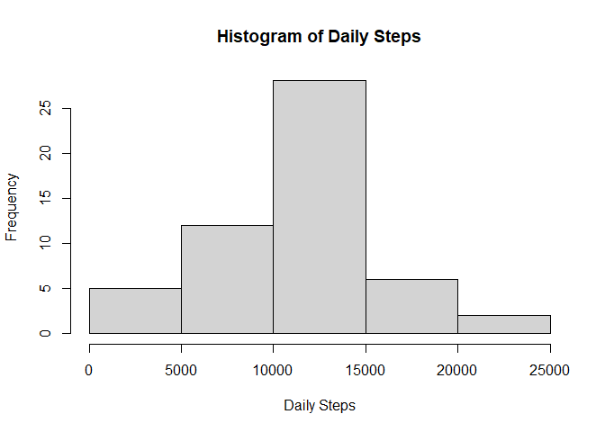
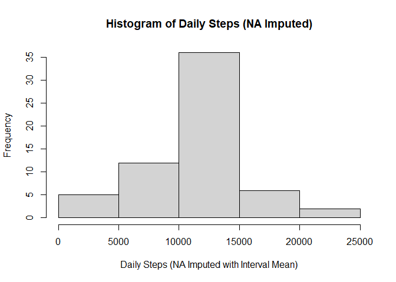
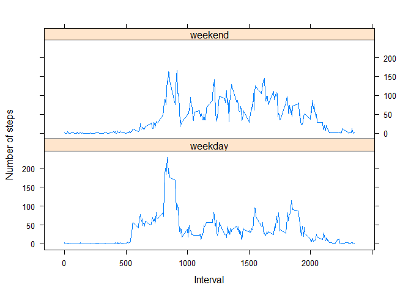

## 1. Code for reading in the dataset and/or processing the data


```r
library(ggplot2)
library(knitr)
library(dplyr)
```

```
## 
## Attaching package: 'dplyr'
```

```
## The following objects are masked from 'package:stats':
## 
##     filter, lag
```

```
## The following objects are masked from 'package:base':
## 
##     intersect, setdiff, setequal, union
```

```r
#getwd()
#dir()

fname <- as.character(unzip("activity.zip", list = TRUE)$Name)
act<- read.csv2(unz("activity.zip", fname), header = TRUE, sep = ",")

head(act)
```

```
##   steps       date interval
## 1    NA 2012-10-01        0
## 2    NA 2012-10-01        5
## 3    NA 2012-10-01       10
## 4    NA 2012-10-01       15
## 5    NA 2012-10-01       20
## 6    NA 2012-10-01       25
```

```r
summary(act)
```

```
##      steps            date              interval     
##  Min.   :  0.00   Length:17568       Min.   :   0.0  
##  1st Qu.:  0.00   Class :character   1st Qu.: 588.8  
##  Median :  0.00   Mode  :character   Median :1177.5  
##  Mean   : 37.38                      Mean   :1177.5  
##  3rd Qu.: 12.00                      3rd Qu.:1766.2  
##  Max.   :806.00                      Max.   :2355.0  
##  NA's   :2304
```


## 2. Histogram of the total number of steps taken each day


```r
#Calculate the total number of steps taken per day
stepsDaily <- aggregate(steps ~ date, act, sum, na.rm=TRUE)
stepsDaily
```

```
##          date steps
## 1  2012-10-02   126
## 2  2012-10-03 11352
## 3  2012-10-04 12116
## 4  2012-10-05 13294
## 5  2012-10-06 15420
## 6  2012-10-07 11015
## 7  2012-10-09 12811
## 8  2012-10-10  9900
## 9  2012-10-11 10304
## 10 2012-10-12 17382
## 11 2012-10-13 12426
## 12 2012-10-14 15098
## 13 2012-10-15 10139
## 14 2012-10-16 15084
## 15 2012-10-17 13452
## 16 2012-10-18 10056
## 17 2012-10-19 11829
## 18 2012-10-20 10395
## 19 2012-10-21  8821
## 20 2012-10-22 13460
## 21 2012-10-23  8918
## 22 2012-10-24  8355
## 23 2012-10-25  2492
## 24 2012-10-26  6778
## 25 2012-10-27 10119
## 26 2012-10-28 11458
## 27 2012-10-29  5018
## 28 2012-10-30  9819
## 29 2012-10-31 15414
## 30 2012-11-02 10600
## 31 2012-11-03 10571
## 32 2012-11-05 10439
## 33 2012-11-06  8334
## 34 2012-11-07 12883
## 35 2012-11-08  3219
## 36 2012-11-11 12608
## 37 2012-11-12 10765
## 38 2012-11-13  7336
## 39 2012-11-15    41
## 40 2012-11-16  5441
## 41 2012-11-17 14339
## 42 2012-11-18 15110
## 43 2012-11-19  8841
## 44 2012-11-20  4472
## 45 2012-11-21 12787
## 46 2012-11-22 20427
## 47 2012-11-23 21194
## 48 2012-11-24 14478
## 49 2012-11-25 11834
## 50 2012-11-26 11162
## 51 2012-11-27 13646
## 52 2012-11-28 10183
## 53 2012-11-29  7047
```

```r
#Histogram

hist(stepsDaily$steps, main ="Histogram of Daily Steps",xlab ="Daily Steps")
```

<!-- -->

## 3. Mean and median number of steps taken each day


```r
meanStepsDaily <- mean(stepsDaily$steps)
medianStepsDaily <- median(stepsDaily$steps)

paste("Mean of steps taken each day:", meanStepsDaily)
```

```
## [1] "Mean of steps taken each day: 10766.1886792453"
```

```r
paste("Median number of steps taken each day:", medianStepsDaily )
```

```
## [1] "Median number of steps taken each day: 10765"
```


## 4. Time series plot of the average number of steps taken


```r
#Make a time series plot (i.e.type = "l") of the 5-minute interval (x-axis) and the average number of steps taken, averaged across all days (y-axis)

stepsInterval<-aggregate(steps~interval, data=act, mean, na.rm=TRUE)
plot(steps~interval, data=stepsInterval, type="l")
```

<!-- -->

## 5. The 5-minute interval that, on average, contains the maximum number of steps


```r
IntervalMaxSteps <- stepsInterval[which.max(stepsInterval$steps),]$interval

paste("The 5-minute interval that, on average, contains the maximum number of steps:", IntervalMaxSteps )
```

```
## [1] "The 5-minute interval that, on average, contains the maximum number of steps: 835"
```

## 6. Code to describe and show a strategy for imputing missing data


```r
#Calculate and report the total number of missing values in the dataset (i.e. the total number of rows with NAs)

TotalNA <- sum(is.na(act$steps))
paste("total number of missing values in the dataset:", TotalNA  )
```

```
## [1] "total number of missing values in the dataset: 2304"
```

## 7. Histogram of the total number of steps taken each day after missing values are imputed


```r
#To fill missing value, we can replace NAs with steps mean. To be more precise , we can also calculate and replace mean at interval level

#Calculate mean steps per interval (Function)

MeanInter<-function(interval){
    stepsInterval[stepsInterval$interval==interval,]$steps
}

#Create a new dataset that is equal to the original dataset but with the missing data filled in. (Replace NA with mean)

act_impute<-act
for(i in 1:nrow(act_impute)){
    if(is.na(act_impute[i,]$steps)){
        act_impute[i,]$steps <- MeanInter(act_impute[i,]$interval)
    }
}

summary(act_impute)
```

```
##      steps            date              interval     
##  Min.   :  0.00   Length:17568       Min.   :   0.0  
##  1st Qu.:  0.00   Class :character   1st Qu.: 588.8  
##  Median :  0.00   Mode  :character   Median :1177.5  
##  Mean   : 37.38                      Mean   :1177.5  
##  3rd Qu.: 27.00                      3rd Qu.:1766.2  
##  Max.   :806.00                      Max.   :2355.0
```

```r
#Make a histogram of the total number of steps taken each day and Calculate and report the mean and median total number of steps taken per day. Do these values differ from the estimates from the first part of the assignment? What is the impact of imputing missing data on the estimates of the total daily number of steps?

#Calculate the total number of steps taken per day with Imputed dataset
stepsDaily_im <- aggregate(steps ~ date, data=act_impute, sum)
stepsDaily_im
```

```
##          date    steps
## 1  2012-10-01 10766.19
## 2  2012-10-02   126.00
## 3  2012-10-03 11352.00
## 4  2012-10-04 12116.00
## 5  2012-10-05 13294.00
## 6  2012-10-06 15420.00
## 7  2012-10-07 11015.00
## 8  2012-10-08 10766.19
## 9  2012-10-09 12811.00
## 10 2012-10-10  9900.00
## 11 2012-10-11 10304.00
## 12 2012-10-12 17382.00
## 13 2012-10-13 12426.00
## 14 2012-10-14 15098.00
## 15 2012-10-15 10139.00
## 16 2012-10-16 15084.00
## 17 2012-10-17 13452.00
## 18 2012-10-18 10056.00
## 19 2012-10-19 11829.00
## 20 2012-10-20 10395.00
## 21 2012-10-21  8821.00
## 22 2012-10-22 13460.00
## 23 2012-10-23  8918.00
## 24 2012-10-24  8355.00
## 25 2012-10-25  2492.00
## 26 2012-10-26  6778.00
## 27 2012-10-27 10119.00
## 28 2012-10-28 11458.00
## 29 2012-10-29  5018.00
## 30 2012-10-30  9819.00
## 31 2012-10-31 15414.00
## 32 2012-11-01 10766.19
## 33 2012-11-02 10600.00
## 34 2012-11-03 10571.00
## 35 2012-11-04 10766.19
## 36 2012-11-05 10439.00
## 37 2012-11-06  8334.00
## 38 2012-11-07 12883.00
## 39 2012-11-08  3219.00
## 40 2012-11-09 10766.19
## 41 2012-11-10 10766.19
## 42 2012-11-11 12608.00
## 43 2012-11-12 10765.00
## 44 2012-11-13  7336.00
## 45 2012-11-14 10766.19
## 46 2012-11-15    41.00
## 47 2012-11-16  5441.00
## 48 2012-11-17 14339.00
## 49 2012-11-18 15110.00
## 50 2012-11-19  8841.00
## 51 2012-11-20  4472.00
## 52 2012-11-21 12787.00
## 53 2012-11-22 20427.00
## 54 2012-11-23 21194.00
## 55 2012-11-24 14478.00
## 56 2012-11-25 11834.00
## 57 2012-11-26 11162.00
## 58 2012-11-27 13646.00
## 59 2012-11-28 10183.00
## 60 2012-11-29  7047.00
## 61 2012-11-30 10766.19
```

```r
#Histogram

hist(stepsDaily_im$steps, main ="Histogram of Daily Steps (NA Imputed)",xlab ="Daily Steps (NA Imputed with Interval Mean)")
```

<!-- -->

```r
#Mean and Median

meanStepsDaily_im <- mean(stepsDaily_im$steps)
medianStepsDaily_im <- median(stepsDaily_im$steps)

paste("Mean of steps taken each day:", meanStepsDaily_im)
```

```
## [1] "Mean of steps taken each day: 10766.1886792453"
```

```r
paste("Median number of steps taken each day:", medianStepsDaily_im)
```

```
## [1] "Median number of steps taken each day: 10766.1886792453"
```

```r
#Impact of data imputation

paste("Data Imputation Impact: No change in Mean, Median had a minute positive shift i.e ",medianStepsDaily," To ", medianStepsDaily_im)
```

```
## [1] "Data Imputation Impact: No change in Mean, Median had a minute positive shift i.e  10765  To  10766.1886792453"
```

## 8. Panel plot comparing the average number of steps taken per 5-minute interval across weekdays and weekends


```r
#Create a new factor variable in the dataset with two levels – “weekday” and “weekend” indicating whether a given date is a weekday or weekend day.

act_impute$date <- as.Date(strptime(act_impute$date, format="%Y-%m-%d"))
act_impute$day <- weekdays(act_impute$date)
for (i in 1:nrow(act_impute)) {
    if (act_impute[i,]$day %in% c("Saturday","Sunday")) {
        act_impute[i,]$day<-"weekend"
    }
    else{
        act_impute[i,]$day<-"weekday"
    }
}
stepsByDay <- aggregate(act_impute$steps ~ act_impute$interval + act_impute$day, act_impute, mean)


#Make a panel plot containing a time series plot (i.e. type = "l") of the 5-minute interval (x-axis) and the average number of steps taken, averaged across all weekday days or weekend days (y-axis). See the README file in the GitHub repository to see an example of what this plot should look like using simulated data.

names(stepsByDay) <- c("interval", "day", "steps")
library(lattice)
xyplot(steps ~ interval | day, stepsByDay, type = "l", layout = c(1, 2), 
    xlab = "Interval", ylab = "Number of steps")
```

<!-- -->

## 9. All of the R code needed to reproduce the results (numbers, plots, etc.) in the report

#Generating through converting in HTML file using knitr package
